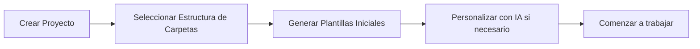
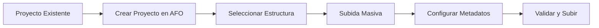
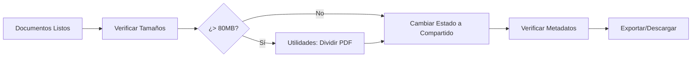
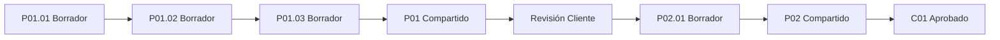

# Módulo de Gestión de Documentos - Guía Completa

## Visión General

El **Gestor Inteligente de Documentos** de AFO CORE MANAGER es un módulo integral diseñado para automatizar y optimizar la gestión documental siguiendo las mejores prácticas del sector arquitectónico español y los estándares internacionales ISO19650-2 y eEMGDE.

## Características Principales

### 1. Estructuras de Carpetas Automatizadas

Al crear un proyecto, el sistema genera automáticamente una estructura de carpetas coherente y profesional. Disponemos de dos modelos:

#### Por Tipo de Archivo (Clásica)
```
01_Planos/
02_Memorias/
03_Presupuestos/
04_Imágenes/
05_Administrativo/
06_Modelos_3D/
07_Instalaciones/
08_Otros/
```

**Ventajas:**
- Intuitiva y familiar para la mayoría de profesionales
- Fácil localización de documentos por su naturaleza
- Ideal para proyectos pequeños y medianos

#### Arquitectura de Gritos (Screaming Architecture)
```
Componentes/        (Detalles constructivos, elementos prefabricados)
Servicios/          (Instalaciones: electricidad, fontanería, climatización)
Modelos/            (Archivos BIM, modelos 3D)
Documentación/      (Memorias, pliegos, anexos)
Administrativo/     (Contratos, licencias, comunicaciones)
Presentación/       (Renders, paneles, concursos)
Referencias/        (Normativa, catálogos, consultas)
```

**Ventajas:**
- Organización funcional que "grita" su propósito
- Mejora la navegación en proyectos complejos
- Facilita el trabajo colaborativo y la localización contextual

### 2. Nomenclatura de Archivos Estandarizada (ISO19650-2)

El sistema implementa automáticamente la nomenclatura según el estándar ISO19650-2:

**Formato:** `CódigoProyecto_Disciplina_TipoDocumento_Descripción_Versión.ext`

**Ejemplo:** `VIV-SESENA_ARQ_MEMORIA_Basico_P03.pdf`

#### Componentes de la Nomenclatura

- **Código de Proyecto:** Identificador único del proyecto (ej: VIV-SESENA)
- **Disciplina:** Área técnica (ARQ, EST, IFC, etc.) según buildingSMART Spain v1.1
- **Tipo de Documento:** Categoría del documento según listado oficial
- **Descripción:** Texto descriptivo breve
- **Versión:** Sistema de versionado inteligente (ver sección siguiente)

### 3. Sistema de Versionado Inteligente

El versionado distingue claramente entre estados del documento:

#### Versiones de Trabajo (Draft)
**Formato:** `P##.##`
- **P03.45** = Entrega 3, guardado interno 45
- Uso: Iteraciones internas durante el desarrollo
- Estado: Borrador (Draft)

#### Versiones de Entrega (Shared)
**Formato:** `P##`
- **P03** = Entrega 3 para revisión externa
- Uso: Versiones compartidas con clientes o colaboradores
- Estado: Compartido (Shared)

#### Versiones Aprobadas (Approved)
**Formato:** `C##`
- **C01** = Versión aprobada final 1
- Uso: Documentos finales y oficiales
- Estado: Aprobado (Approved)

**Flujo típico de versionado:**
```
P01.01 → P01.02 → P01.03 → P01 (compartido) →
P02.01 → P02.02 → P02 (compartido) →
C01 (aprobado)
```

### 4. Gestión de Metadatos (eEMGDE)

Todos los documentos se enriquecen automáticamente con metadatos esenciales según el esquema eEMGDE (Esquema de Metadatos para la Gestión del Documento Electrónico):

#### Metadatos Automáticos
- **Identificador Único:** UUID generado automáticamente
- **Fechas:**
  - Fecha de creación
  - Fecha de última modificación
  - Fecha de inicio de validez
  - Fecha de fin de validez
- **Características Técnicas:**
  - Formato del archivo (MIME type)
  - Tamaño en bytes
  - Versión del formato
  - Aplicación de creación

#### Metadatos Contextuales
- **Disciplina:** Categoría técnica del documento
- **Descripción:** Descripción textual del contenido
- **Estado:** Borrador, Compartido o Aprobado
- **Usuario:** Persona que subió el documento
- **Proyecto:** Vinculación al proyecto

### 5. Búsqueda y Filtrado Avanzado

El sistema de búsqueda permite localizar documentos instantáneamente mediante múltiples criterios:

#### Criterios de Búsqueda
- **Texto libre:** Busca en nombre, descripción y metadatos
- **Tipo de documento:** Filtra por categoría (Planos, Memorias, etc.)
- **Estado:** Borrador, Compartido, Aprobado
- **Disciplina:** Categoría técnica específica
- **Carpeta:** Ubicación en la estructura de carpetas

#### Características de Búsqueda
- Resultados en tiempo real mientras se escribe
- Filtros combinables (operación AND lógica)
- Visualización de filtros activos con badges
- Contador de resultados
- Limpieza individual o global de filtros

### 6. Subida Masiva de Documentos (Bulk Upload)

Acelera drásticamente la importación de proyectos existentes o grandes volúmenes de documentación:

#### Funcionalidades
- **Drag & Drop:** Arrastra archivos directamente a la zona de subida
- **Selección múltiple:** Selecciona decenas de archivos simultáneamente
- **Metadatos por defecto:** Configura tipo, carpeta y disciplina una sola vez
- **Ajuste individual:** Modifica metadatos de archivos específicos si es necesario
- **Validación automática:** Verifica nombres y formatos antes de subir
- **Progreso en tiempo real:** Visualiza el estado de cada archivo
- **Gestión de errores:** Identifica y maneja archivos problemáticos

#### Formatos Soportados
- **Documentos:** PDF, DOC, DOCX, ODT, TXT
- **Planos:** DWG, DXF, DGN
- **Imágenes:** JPG, PNG, TIFF, BMP
- **Hojas de cálculo:** XLS, XLSX, ODS
- **Modelos 3D:** SKP, IFC, RVT (metadatos)

### 7. Plantillas de Documentos con IA

Generación inteligente de documentos arquitectónicos profesionales:

#### Categorías de Plantillas

**Memorias**
- Memoria de Proyecto Básico
- Memoria de Proyecto de Ejecución
- Memoria Descriptiva
- Memoria Constructiva

**Planos**
- Carátula de Planos
- Índice de Planos
- Cuadro de Superficies

**Administrativo**
- Certificado Final de Obra
- Acta de Replanteo
- Libro de Órdenes

**Presupuestos**
- Mediciones y Presupuesto
- Estudio de Gestión de Residuos

**Justificaciones**
- Justificación CTE-HE (Eficiencia Energética)
- Justificación CTE-SI (Seguridad en caso de Incendio)
- Justificación CTE-SUA (Seguridad de Utilización y Accesibilidad)

#### Generación con IA

Cada plantilla puede personalizarse con contenido generado por IA:

**Características:**
- **Contexto del proyecto:** La IA conoce título, ubicación y fase del proyecto
- **Tono configurable:** Formal, Descriptivo, Conciso o Normativo
- **Longitud ajustable:** Breve, Media o Detallada
- **Referencias normativas:** Incluye citas a CTE, RITE, REBT automáticamente
- **Múltiples secciones:** Genera contenido independiente para cada apartado
- **Regeneración:** Prueba diferentes versiones hasta encontrar la ideal

### 8. Utilidades de Documentos

Herramientas especializadas para manipulación de archivos:

#### Dividir PDFs Grandes

**Problema resuelto:** Las plataformas de visado colegial (COAM, COACM) tienen límites de tamaño (típicamente 80 MB).

**Funcionalidad:**
- Define el tamaño máximo por archivo resultante
- Selecciona el PDF a dividir
- El sistema calcula automáticamente el número de partes necesarias
- Genera múltiples PDFs más pequeños manteniendo la calidad

**⚠️ Advertencia importante:**
> La división de un PDF invalidará cualquier firma digital existente. Realice este proceso ANTES de firmar digitalmente los documentos.

#### Gestión de Metadatos

Visualización e información sobre los metadatos gestionados automáticamente por el sistema según el estándar eEMGDE.

### 9. Vistas Múltiples del Repositorio

El gestor ofrece tres vistas diferentes para adaptarse a distintas necesidades:

#### Vista Lista (Por Defecto)
- Listado completo de todos los documentos
- Información detallada de cada documento
- Ideal para búsquedas y revisiones generales
- Visualización de versión actual y estado

#### Vista Por Carpetas
- Agrupa documentos por su ubicación en la estructura
- Vista en tarjetas compactas dentro de cada carpeta
- Contador de documentos por carpeta
- Ideal para navegación contextual

#### Vista Estadísticas
- Panel de métricas del repositorio documental
- **Estadísticas por tipo:** Cuántos planos, memorias, presupuestos, etc.
- **Estadísticas por estado:** Borradores, compartidos, aprobados
- **Información general:**
  - Total de documentos
  - Total de versiones
  - Tamaño total del repositorio
  - Número de disciplinas únicas
- Ideal para análisis y reporting

### 10. Control de Versiones Completo

Cada documento mantiene un historial completo de todas sus versiones:

#### Información de Versiones
- Número de versión (P01, P02, C01, etc.)
- Nombre del archivo
- Tamaño del archivo
- Fecha de subida
- Usuario que subió
- Estado (Borrador, Compartido, Aprobado)
- Notas opcionales

#### Operaciones con Versiones
- **Visualizar historial:** Ver todas las versiones anteriores
- **Añadir nueva versión:** Subir una actualización
- **Cambiar estado:** Promocionar de borrador a compartido o aprobado
- **Añadir notas:** Documentar cambios o comentarios
- **Comparar versiones:** Ver diferencias entre versiones (visual)

## Flujos de Trabajo Recomendados

### Flujo 1: Inicio de Proyecto Nuevo



1. Crea el proyecto en AFO CORE MANAGER
2. Selecciona la estructura de carpetas (Por Tipo o Screaming Architecture)
3. Ve al Gestor de Documentos
4. Utiliza "Plantillas" para generar documentos iniciales
5. Personaliza secciones con IA según necesites
6. Descarga y comienza a trabajar

### Flujo 2: Importación de Proyecto Existente



1. Crea el proyecto en AFO CORE MANAGER
2. Selecciona la estructura de carpetas más apropiada
3. Click en "Subida Masiva"
4. Configura metadatos por defecto (tipo, carpeta, disciplina)
5. Arrastra todos los archivos existentes
6. Ajusta metadatos individuales si es necesario
7. Confirma la subida

### Flujo 3: Preparación para Visado Colegial



1. Finaliza todos los documentos requeridos
2. Verifica que ningún PDF supere los 80 MB
3. Si alguno es mayor, usa "Utilidades > Dividir PDF"
4. Cambia el estado de todos los documentos a "Compartido" (versión P##)
5. Verifica que todos los metadatos sean correctos
6. Descarga los documentos para el proceso de visado

### Flujo 4: Evolución de Documento Durante el Proyecto



1. Comienza con versión borrador (P01.01)
2. Realiza modificaciones internas (P01.02, P01.03, etc.)
3. Al finalizar, cambia estado a "Compartido" (P01)
4. Envía al cliente para revisión
5. Recibe comentarios, crea nueva entrega (P02.01)
6. Aplica modificaciones (P02.02, etc.)
7. Comparte versión corregida (P02)
8. Al recibir aprobación final, cambia a "Aprobado" (C01)

## Mejores Prácticas

### 1. Nomenclatura Consistente

✅ **Bien:**
```
VIV-SESENA_ARQ_MEMORIA_Basico_P01.pdf
VIV-SESENA_ARQ_PLANO_Planta-Baja_P01.dwg
VIV-SESENA_EST_CALCULO_Estructura_P01.pdf
```

❌ **Evitar:**
```
memoria v3 final FINAL.pdf
planta baja - copia.dwg
estructura corregida.pdf
```

### 2. Uso Correcto de Estados

- **Borrador (Draft):** Solo para trabajo interno
- **Compartido (Shared):** Para revisión externa (clientes, colaboradores)
- **Aprobado (Approved):** Solo versiones finales oficiales

### 3. Metadatos Completos

Siempre completa:
- Disciplina (especialmente importante)
- Descripción clara y concisa
- Tipo de documento correcto
- Carpeta apropiada

### 4. Organización de Versiones

- No elimines versiones antiguas (el sistema las gestiona)
- Añade notas explicativas en cambios importantes
- Promociona el estado solo cuando sea definitivo

### 5. Búsqueda Eficiente

Combina filtros para búsquedas precisas:
- Texto + Tipo + Estado
- Carpeta + Disciplina
- Estado + Fecha (próximamente)

## Ventajas del Sistema

### Para el Arquitecto Autónomo

1. **Ahorro de tiempo:** Nomenclatura y metadatos automáticos
2. **Reducción de errores:** Validación y estándares incorporados
3. **Trazabilidad completa:** Historial de versiones exhaustivo
4. **Cumplimiento normativo:** ISO19650-2 y eEMGDE integrados
5. **Reutilización:** Plantillas y estructuras predefinidas
6. **Profesionalidad:** Documentación organizada y estandarizada

### Para el Proyecto

1. **Coherencia:** Todos los documentos siguen el mismo patrón
2. **Localización rápida:** Búsqueda y filtrado potentes
3. **Control de calidad:** Metadatos completos y versiones claras
4. **Colaboración:** Estado compartido claramente identificado
5. **Auditoría:** Registro completo de cambios y evolución

### Para el Estudio

1. **Estandarización:** Misma metodología en todos los proyectos
2. **Formación simplificada:** Sistema intuitivo para nuevos colaboradores
3. **Escalabilidad:** Funciona igual para 10 que para 1000 documentos
4. **Interoperabilidad:** Estándares internacionales aseguran compatibilidad
5. **Profesionalización:** Imagen seria y organizada ante clientes

## Soporte y Documentación Adicional

### Estándares Implementados

- **ISO19650-2:** Information management using building information modelling
- **eEMGDE:** Esquema de Metadatos para la Gestión del Documento Electrónico
- **buildingSMART Spain:** Listados de disciplinas y tipos de documento v1.1

### Referencias Normativas

- Manual de Nomenclatura de Documentos buildingSMART Spain
- Guía de buenas prácticas en gestión documental (CSCAE)
- Recomendaciones del COAM para presentación de proyectos

## Conclusión

El **Gestor Inteligente de Documentos** de AFO CORE MANAGER no es simplemente un repositorio de archivos. Es un sistema integral que:

- **Automatiza** tareas repetitivas y propensas a errores
- **Estandariza** la gestión documental según normas internacionales
- **Acelera** los flujos de trabajo con herramientas inteligentes
- **Profesionaliza** la imagen del estudio arquitectónico
- **Garantiza** la trazabilidad y el cumplimiento normativo

Al integrar estas funcionalidades en tu flujo de trabajo diario, conseguirás:
- ⏱️ **Ahorro de tiempo:** Hasta un 40% menos en gestión documental
- 🎯 **Precisión:** Cero errores en nomenclatura y versionado
- 🔍 **Acceso inmediato:** Localiza cualquier documento en segundos
- 🏛️ **Cumplimiento:** ISO19650-2 y eEMGDE nativos
- 🚀 **Productividad:** Dedica más tiempo al diseño, menos a la administración

---

**AFO CORE MANAGER** - *Gestión Integral de Proyectos Arquitectónicos*
